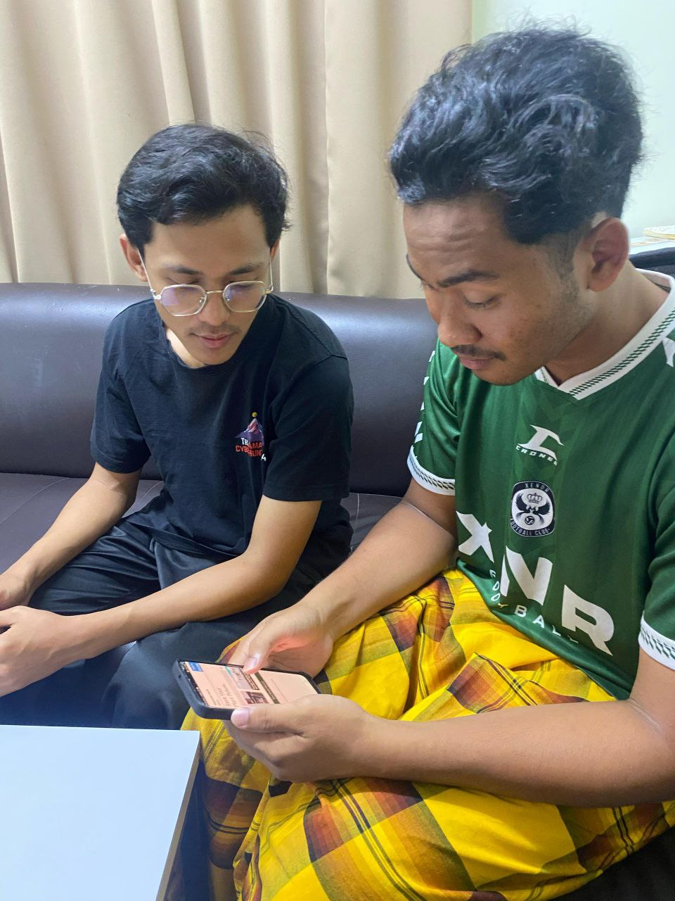

# 🌿 SmartPlant

SmartPlant is an AI-powered mobile app designed to help users detect and treat plant diseases. Using advanced AI tools and weather data integration, SmartPlant provides real-time disease predictions, personalized treatment advice, and proactive solutions. Users can also save their plant health records and stay informed with the latest plant disease news, ensuring healthier plants and better crop yields.

---

## 📥 Get Started with SmartPlant 

This guide will walk you through setting up the **SmartPlant** app on your machine using **Expo Go**. 

### Scan QR Code (Option 1 - Fastest Way + Recommended) 

Download the Expo Go app from the Play Store. Scan the QR code below directly using the Expo Go app (Android).
For iOS, open the Expo Go app, go to **Settings**, allow all required permissions, and then scan the QR code using your device’s native camera app.
<p align="center">
  
</p>

### Clone the Repository (Option 2)

First, you need to clone the project to your local machine. Open a terminal (Command Prompt, PowerShell, or Terminal on macOS/Linux) and run the following command:

```bash
git clone https://github.com/FoxlyTenTen/SmartPlant.git
cd smartplant
npm install
npx expo start
```
### Run the App

**Option 1** – Download the Expo Go app from the Play Store. Make sure your computer and device are on the same local network. Scan the QR code provided in the terminal and boom—you can preview the app!

**Option 2** – Press a in the terminal to launch the Android emulator.

**Option 3** – Press i in the terminal to launch the iOS emulator.

## 🔗 Links

- 📹 [Demo Video](https://youtu.be/qvqbWoNrX4k?feature=shared)  
- 🎨 [Figma Prototype](https://www.figma.com/proto/CIm36rip9n48e1lAOYB4ow/SmartPlant?node-id=0-1&t=af9HSDsSEVhhfRce-1)
---

## 📚 Table of Contents

- [Challenges](#challenges)
- [Introduction](#introduction)
- [Key Features](#key-features)
- [Technology Architecture](#technology-architecture)
- [SDG Alignment](#sdg-alignment)
- [User Feedback](#user-feedback)
- [Future Prospect](#future-prospect)
- [Nature of this Project](#nature-of-this-project)

---

## 🚧 Challenges

- **Food Insecurity**  
  Agriculture is vital for global food security, but crop diseases threaten yields, causing economic losses and food shortages. Farmers face difficulties in detecting diseases early and often lack access to timely expert guidance.

- **Traditional Farming Limitations**  
  Traditional diagnosis methods are typically slow, require specialist knowledge, and are often inaccessible in rural or remote areas—making timely action difficult.

- **Uncertain Weather Conditions**  
  Weather plays a major role in triggering disease outbreaks. However, farmers rarely have access to data-driven insights to predict and prevent such occurrences, increasing their vulnerability.

---

## 🌱 Introduction

SmartPlant tackles the critical challenges faced in modern agriculture—ranging from crop disease outbreaks and weather uncertainties to limited expert access in rural areas. This AI-powered mobile application empowers farmers by providing early disease detection through image analysis, real-time treatment recommendations via chatbot, and weather-integrated future disease predictions using a RAG assistant. Designed for both rural and urban farmers, SmartPlant promotes proactive, data-driven farming practices to enhance crop health, reduce losses, and ensure sustainable food production.

---

## 🌟 Key Features

1. **AI-Powered Disease Detection**  
   Instantly detects plant diseases by analyzing uploaded or captured plant images using AI tools.

2. **Treatment Recommendation Chatbot**  
   Provides real-time, AI-generated treatment suggestions and care tips through an interactive chat interface powered by Gemini API.

3. **Weather-Integrated Forecasting**  
   Leverages current, past, and future weather data to predict potential disease outbreaks using a RAG assistant.

4. **Smart Disease Prediction**  
   Uses historical disease records and weather trends to deliver proactive insights and alert farmers before outbreaks occur.

5. **User Record Saving**  
   Allows users to save conversation summaries, disease predictions, and actions taken for future reference and planning.

6. **Farming News Hub**  
   Aggregates and displays the latest agriculture and plant disease news to keep users informed about farming trends and threats.

7. **Location-Based Analysis**  
   Detects user location and provides relevant weather forecasts and disease predictions specific to their farming area.

8. **Scalable Crop Support**  
   Initially supports rice and common crops, with future expansion planned for fruits, vegetables, and other plant types.

---

## 🧠 Technology Architecture


SmartPlant leverages a robust and scalable technology stack, combining AI, weather APIs, and cloud services to deliver an intelligent plant disease management system. The architecture is designed to ensure seamless user interaction, real-time predictions, and actionable insights tailored to the farmer’s location and needs.

### Technologies Used:

**React Native**  
Used as the primary mobile app development framework to build and deploy the SmartPlant application across platforms.

**NewsAPI**  
Fetches the latest farming-related news and trends. Users can also search for preferred topics to stay informed and gain agricultural insights.

**Plant.id API**  
Analyzes uploaded plant images to predict diseases across various classes with associated probability scores for accuracy.

**Firebase**  
Handles user authentication and authorization. It also stores user-chatbot interactions and the information provided by the RAG Assistant for future reference.

**WeatherAPI**  
Provides both historical and forecasted weather data for any location, helping users correlate weather patterns with potential plant diseases.

**Google Maps API**  
Enables the app to access users’ current geolocation, making it easier to fetch localized weather information automatically.

**Google Cloud Platform (GCP)**  
Serves as the backend infrastructure, offering scalable cloud services and seamless integration with Google’s AI tools and APIs.

**Gemini LLM (Large Language Model)**  
Acts as a conversational AI chatbot that provides treatment recommendations based on user queries. Enhances user engagement through natural, intelligent interactions.

**RAG (Retrieval-Augmented Generation)**  
An intelligent assistant that retrieves user history and combines it with current and historical weather data to provide future disease predictions and actionable planning insights.

---

## 🌍 SDG Alignment

- **SDG 2: Zero Hunger** – Helps farmers detect diseases early for better crop yields and food security.
- **SDG 13: Climate Action** – Uses weather data to predict and adapt to climate-driven disease outbreaks.
- **SDG 3: Good Health & Well-being** – Reduces reliance on harmful chemicals and promotes sustainable disease management.
- **SDG 12: Responsible Consumption & Production** – Supports sustainable farming practices by reducing crop losses.
- **SDG 9: Industry, Innovation & Infrastructure** – Leverages AI and data to improve agricultural efficiency.
- **SDG 17: Partnerships for the Goals** – Encourages collaboration among farmers, tech providers, and researchers.

---

## 🗣️ User Feedback

👩‍🌾 Nur Aminah
<p>
  
</p>
Nur Aminah binti Suhaib, a 45-year-old local tomato farmer, shared that the app should provide access to the latest news and trends. This would help her develop more efficient plans for her crops.


🥬 Zainab Abidin
<p>
  
</p>
Zainab binti Abidin, a 52-year-old local vegetable farmer from Kok Lanas, suggested that the app include user geolocation. She finds it time-consuming to manually search for her current location, especially due to her age.

🌴 Muhammad Naqib
<p>
  
</p>
Muhammad Naqib bin Mustapha, a 25-year-old local oil palm farmer, felt that the app interface looks too basic and unattractive. He recommended a more refreshed layout with a modern design to improve the overall user experience.

---

## 🔮 Future Prospect

- Add a recommendation marketplace for eco-friendly pesticides.
- Implement a community feature for farmers to share insights and best practices.
- Incorporate predictive analytics for long-term disease and weather trends.

---

## 📝 Nature of this Project

**Project Title:** SmartPlant  
**Team Name:** AX10S
**Hackathon:** KitaHack 2025  
**Team Members:** Mohd Adli Syukri bin Noraman, Muhammad Irfan Azraei bin Izhar Kamil, Muhammad Adli bin Rosdan, Muhammad Haziq bin Abdullah  
**Institution:** Universiti Tenaga Nasional (UNITEN) 

### 📚 Nature of Use  
This project is a submission for the **KitaHack 2025 Hackathon**, intended exclusively for educational and competition purposes. The listed team members are students from **UNITEN**, and the project reflects the academic and innovative effort made during the hackathon.


---
